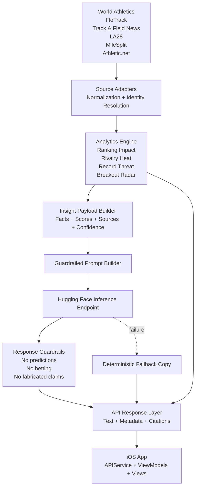

# Athena – MVP Architecture & Feature Specification

## Overview
Athena is a lightweight, AI‑augmented iOS companion app for competitive sports. It blends historical context, athlete‑centric following, event awareness, and broadcast discovery into a clear, confident intelligence layer.

Athena centers on ecosystem awareness, not just result interpretation: what happened, what is happening now, and what to watch next.

**Positioning:** Strategic intelligence for modern competition  
**Starting Sport:** Track & Field  
**Designed to Scale:** Multi‑sport

---

## MVP Goals
- Ship a polished iOS app during a coding event
- Demonstrate AI as an analytical and explanatory tool
- Remain local‑first with minimal infrastructure
- Establish a scalable foundation beyond a single sport

## Source Inputs (Initial)
- World Athletics historical context: https://worldathletics.org/stats-zone
- FloTrack ranking movement: https://www.flotrack.org/rankings
- Track and Field News major results references: https://trackandfieldnews.com/major-results-links/
- LA28 athletics event list context: https://hospitality.la28.org/en/event-discipline/athletics
- MileSplit high school result and athlete coverage: https://www.milesplit.com/
- Athletic.net high school and collegiate performance coverage: https://www.athletic.net/

## Non‑Goals
- Fully automated data ingestion
- Social feeds or messaging
- Betting, fantasy, or predictions

---

## Core MVP Features

### 1. Home Feed (Situational Awareness)
**Purpose:** Answer “What matters right now?”

- Recent major results
- Upcoming competitions
- Notable ranking movement
- AI‑generated storyline summary (≤100 words)

---

### 2. Athlete Following
**Purpose:** Personalize intelligence.

- Follow / unfollow athletes
- Athlete profile:
  - Events
  - Recent results
  - Season best / personal best
- AI “form and momentum” explanation

---

### 3. Event Detail & Where to Watch
**Purpose:** Connect insight to action.

- Event name, date, location
- Featured competitions
- Broadcast / streaming availability (best‑effort)
- Localized start time for the user

User note:
- Broadcast details are based on publicly available schedules and may vary by region.

---

### 4. Performance Insight Cards (AI‑Powered)
**Purpose:** Explain significance, not predict outcomes.

For each result:
- Why this performance matters
- Historical or Olympic‑cycle context
- Ranking relevance

AI output principles:
- Concise
- Explanatory
- Non‑predictive
- Confident but neutral

AI feed/storyline tasks:
- Top 3 storylines for the weekend
- Olympic-cycle relevance signals
- Athlete trend context over recent 30-60 day windows

---

### 5. Notifications (Limited MVP)
**Purpose:** Maintain awareness without noise.

- Athlete you follow competing today
- Athlete you follow posts a major result
- Major ranking movement for followed athletes

User controls:
- Global on/off
- Per‑athlete toggle

Optional controls post-MVP:
- Event group preferences (sprints, hurdles, distance, field)
- Frequency presets (low, medium, high)

---

## VibeCon Scope Lock (Build First)

Must-ship boundaries for event delivery:
- 5 athletes tracked
- 3 meets represented
- 1 notification type enabled (athlete competing today)
- 1 AI storyline card module with deterministic fallback text

---

## AI Architecture

### AI Role
AI functions as an **analyst**, similar to Athena’s mythological role:
- Strategic
- Interpretable
- Grounded in context

### Responsibilities
- Summarize performance significance
- Compare results to historical benchmarks
- Explain trends in accessible language

### Model Strategy
- Hugging Face hosted inference
- Prompt‑first approach
- Offline fallback where AI unavailable

---

## iOS Architecture

- Swift + SwiftUI
- MVVM (lightweight)

---

## Logical Execution Order

1. Expand and normalize source coverage across pro, NCAA, and high school layers.
2. Ship deterministic analytics for importance, rivalry, records, and breakout detection.
3. Use Hugging Face to explain verified signals, not invent them.
4. Harden delivery paths: backend notifications, offline caching, and quality gates.

---

## MVP+ Product Wedge

Athena's strongest product story after the MVP is a four-part analytical layer:

### 1. Ranking Impact Simulator
**Purpose:** Show how a result could change the competitive picture without claiming certainty.

Core inputs:
- Current ranking tier
- Event prestige
- Field strength
- Placement quality
- Recency window

Scoring approach:
- Start with an event significance base score.
- Add field-strength weight based on ranking density and known elite entrants.
- Add placement delta based on podium/top-8 quality.
- Convert to a simple impact band: low, moderate, high, major.

UI placement:
- Meet detail cards
- Result insight cards
- Notification copy for major shifts

### 2. Rivalry Heat Index
**Purpose:** Surface matchups that feel alive right now.

Core inputs:
- Recent head-to-head overlap
- Ranking proximity
- Season-best proximity
- Shared upcoming meets
- Championship relevance

Scoring approach:
- Weight shared upcoming meets highest.
- Increase score when competitors are close in rank and recent marks.
- Add heat when the matchup has repeated in recent windows.

UI placement:
- Home feed storylines
- Athlete profile comparison modules
- Meet pre-event previews

### 3. Record Threat / Milestone Watch
**Purpose:** Turn raw marks into urgency and context.

Core inputs:
- Distance to PB/SB/WL/NR/meet record/WR
- Season timing
- Venue or meet prestige
- Trend over recent results

Scoring approach:
- Calculate proximity to milestone thresholds.
- Increase score when the athlete has repeated near-threshold marks.
- Raise urgency near major meets and historically fast/strong windows.

UI placement:
- Athlete profile hero module
- Event detail cards
- Home feed alerts and watchlist ranking

### 4. Breakout Radar
**Purpose:** Catch who matters next, not just who matters now.

Breakout Radar must include high school and NCAA athletes when their marks become relevant to broader competitive conversations.

Example use case:
- Quincy Wilson-style emergence where a youth athlete posts marks relevant to elite/pro discussion before full professional visibility catches up.

UI placement:
- Home feed breakout rail
- Athlete directory spotlight section
- Optional dedicated "Next Up" tab post-MVP

---

## Breakout Radar Formula

Breakout Radar should be deterministic, explainable, and tier-aware.

### Inputs
- Competition tier: high school, NCAA, professional
- Athlete age/class year when available
- Best recent mark
- Improvement rate over 30/60/180 day windows
- Peer percentile within tier
- Proximity to elite/open benchmarks
- Meet quality and field quality
- Repetition: one-off mark vs repeated performance

### Score Components
- Benchmark Relevance (0-30)
  - How close the mark is to elite/open-level comparison points.
- Tier Dominance (0-20)
  - How unusual the mark is within the athlete's own level.
- Improvement Velocity (0-20)
  - How quickly recent marks are improving.
- Competition Quality (0-15)
  - Whether the mark came in a meaningful meet or strong field.
- Repeatability (0-15)
  - Whether the signal is supported by multiple recent performances.

### Output Bands
- Watchlist
- Emerging
- Breakout
- Breakout Priority

### Required Explanation
Every Breakout Radar card must answer:
- Why is this athlete surfacing now?
- Which benchmark is being crossed or approached?
- What competition tier is this based on?

---

## Data Coverage Needed For Breakout Radar

### Core Sources
- World Athletics for elite/open historical and benchmark context
- FloTrack for ranking movement and pro narrative relevance
- Track & Field News for major-results verification
- MileSplit for high school athlete/result coverage
- Athletic.net for high school and collegiate result coverage

### Normalized Fields
- Athlete name and stable athlete identifier
- Competition tier
- Event discipline and event normalization
- Mark/time and wind/conditions when available
- Meet name, location, and date
- Source provenance and fetch timestamp

### Coverage Risks
- Duplicate athletes across youth, college, and pro sources
- Event naming inconsistencies
- Incomplete wind/condition metadata
- Uneven regional coverage for youth meets

### Mitigations
- Identity resolution layer for athlete merging
- Event normalization tables by discipline
- Confidence labels when benchmark comparison is partial
- Clear provenance shown on each surfaced breakout athlete

---

## Hugging Face Role In This Architecture

Hugging Face should explain verified analytics, not replace them.

Recommended split:
- Deterministic code computes ranking impact, rivalry heat, milestone threat, and breakout score.
- Hugging Face inference converts those verified signals into concise analytical summaries.
- Guardrails enforce non-predictive, source-grounded output before display.

---

## Athena + Hugging Face Reference Architecture

### Design Principle

Athena should separate truth computation from language generation.

- The data layer gathers and normalizes source facts.
- The analytics layer computes deterministic scores and benchmark comparisons.
- The AI layer explains those verified signals in Athena voice.
- The guardrail layer blocks unsupported, speculative, or unsafe output before anything reaches the user.

This keeps the app fast, trustworthy, and resilient even when AI inference is slow or unavailable.

### Runtime Flow

1. Source adapters ingest and normalize results from pro, NCAA, and high school sources.
2. Athena backend computes feature outputs such as Ranking Impact, Rivalry Heat, Record Threat, and Breakout Radar.
3. The backend packages those analytics into a structured insight payload.
4. A Hugging Face inference endpoint receives only verified fields plus a constrained prompt.
5. Returned text is validated against Athena guardrails.
6. The app receives both the deterministic scores and the approved explanation text.
7. If inference fails, Athena falls back to deterministic copy templates and still ships the score/result surfaces.

### Mermaid Diagram



### Backend Component Responsibilities

#### 1. Source Adapters
- Pull or ingest source-specific result and athlete records.
- Normalize event names, times/marks, competition tiers, and identifiers.
- Preserve provenance for every record.

#### 2. Identity Resolution Layer
- Merge the same athlete across youth, NCAA, and pro ecosystems where confidence is high.
- Keep source-specific aliases when identity confidence is not sufficient.
- Prevent false merges from contaminating Breakout Radar.

#### 3. Analytics Engine
- Computes all product-critical scores deterministically.
- Produces explanation inputs such as benchmark crossed, recent delta, field strength, or rivalry overlap.
- Emits confidence and completeness flags.

#### 4. Insight Payload Builder
- Creates a model-safe JSON payload containing:
  - athlete/event/meet facts
  - score outputs and output bands
  - source list
  - confidence label
  - known data gaps

#### 5. Prompt Builder
- Uses Athena prompt contract and role definition.
- Prevents the model from receiving open-ended instructions.
- Restricts generation to explanation and summarization tasks only.

#### 6. Response Guardrails
- Rejects or rewrites model output that contains prediction, betting language, fabricated facts, or unsupported certainty.
- Enforces length, tone, and source-grounding rules.
- Falls back to deterministic copy when compliance fails.

### Suggested Insight Payload Schema

```json
{
  "feature": "breakout_radar",
  "athlete": {
    "id": "athlete_123",
    "name": "Example Athlete",
    "tier": "high_school",
    "discipline": "400m"
  },
  "result": {
    "mark": "44.20",
    "date": "2026-04-28T12:00:00Z",
    "meet": "Penn Relays"
  },
  "analytics": {
    "score": 87,
    "band": "Breakout Priority",
    "benchmark_relevance": 28,
    "tier_dominance": 18,
    "improvement_velocity": 17,
    "competition_quality": 12,
    "repeatability": 12
  },
  "context": {
    "benchmarkCrossed": "elite_open_relevance",
    "comparisonSet": "high_school_400m_national",
    "confidence": "medium",
    "dataGaps": ["wind unavailable"]
  },
  "sources": [
    "milesplit",
    "athletic_net"
  ]
}
```

### Suggested Hugging Face Task Boundaries

Use Hugging Face for:
- storyline summarization
- performance significance explanation
- score explanation in natural language
- concise notification copy variants

Do not use Hugging Face for:
- ranking calculations
- breakout detection logic
- athlete identity resolution
- factual source selection
- truth arbitration between conflicting results

### Repo Mapping

Current repo alignment:
- `Services/APIService.swift` is the client-side API gateway and fallback layer.
- `ViewModels/HomeViewModel.swift` and `ViewModels/MeetViewModel.swift` already carry metadata and warning state needed for AI/fallback display.
- `Services/NotificationService.swift` already has the right boundary to consume analytics-driven alert decisions once backend scheduling is complete.

Planned extension points:
- Add backend endpoints for analytics payloads and AI-generated explanation text.
- Add local cache persistence for last-known analytics payloads.
- Add tests that assert model outputs remain optional and never block deterministic surfaces.

### Service Contract Recommendation

Recommended backend endpoints:
- `GET /athletes`
- `GET /meets`
- `GET /storylines`
- `GET /analytics/breakouts`
- `GET /analytics/rivalries`
- `GET /analytics/milestones`
- `POST /insights/explain`

Recommended response behavior:
- Always return deterministic score objects even if generated text is absent.
- Include `generatedAt`, `sourceCitations`, `confidence`, and `fallbackReason` fields.
- Keep AI explanation text nullable so the UI never depends on model success.

---

## Backend API Contract

### Response Envelope

All Athena backend endpoints should return a shared envelope so the iOS app can process metadata consistently.

```json
{
  "data": {},
  "meta": {
    "generatedAt": "2026-04-29T18:45:00Z",
    "sourceCitations": [
      "World Athletics",
      "MileSplit",
      "Athletic.net"
    ],
    "confidence": "medium",
    "fallbackReason": null,
    "requestId": "req_12345"
  }
}
```

Field notes:
- `generatedAt`: when the backend assembled the response.
- `sourceCitations`: human-readable source names for UI display.
- `confidence`: `high`, `medium`, or `low` depending on source completeness and signal quality.
- `fallbackReason`: populated when deterministic fallback copy or stale cache is used.
- `requestId`: useful for tracing failures and feedback loops.

### GET /analytics/breakouts

Purpose:
- Return the current breakout candidates across high school, NCAA, and professional tiers.

Example response:

```json
{
  "data": [
    {
      "athlete": {
        "id": "athlete_123",
        "name": "Example Athlete",
        "tier": "high_school",
        "discipline": "400m",
        "profileImageUrl": null
      },
      "result": {
        "mark": "44.20",
        "date": "2026-04-28T12:00:00Z",
        "meet": "Penn Relays"
      },
      "breakout": {
        "score": 87,
        "band": "Breakout Priority",
        "benchmarkRelevance": 28,
        "tierDominance": 18,
        "improvementVelocity": 17,
        "competitionQuality": 12,
        "repeatability": 12,
        "benchmarkLabel": "elite_open_relevance"
      },
      "insight": {
        "text": "This high school 400m mark is already relevant against elite open benchmarks and is supported by repeated high-end performances.",
        "source": "huggingface",
        "guardrailed": true
      }
    }
  ],
  "meta": {
    "generatedAt": "2026-04-29T18:45:00Z",
    "sourceCitations": ["MileSplit", "Athletic.net"],
    "confidence": "medium",
    "fallbackReason": null,
    "requestId": "req_breakouts_001"
  }
}
```

### GET /analytics/rivalries

Purpose:
- Return rivalry pairs ranked by current heat and relevance.

Example response:

```json
{
  "data": [
    {
      "athletes": [
        {"id": "a1", "name": "Athlete A"},
        {"id": "a2", "name": "Athlete B"}
      ],
      "rivalry": {
        "score": 81,
        "band": "High Heat",
        "rankingProximity": 18,
        "seasonBestProximity": 17,
        "upcomingMeetOverlap": 24,
        "recentHeadToHead": 12,
        "championshipRelevance": 10
      },
      "insight": {
        "text": "These athletes are converging in ranking, recent form, and upcoming meet overlap, making this one of the liveliest matchups on the calendar.",
        "source": "huggingface",
        "guardrailed": true
      }
    }
  ],
  "meta": {
    "generatedAt": "2026-04-29T18:45:00Z",
    "sourceCitations": ["World Athletics", "FloTrack"],
    "confidence": "high",
    "fallbackReason": null,
    "requestId": "req_rivalries_001"
  }
}
```

### GET /analytics/milestones

Purpose:
- Return athlete and event milestone threats such as PB, SB, WL, NR, meet record, and WR proximity.

Example response:

```json
{
  "data": [
    {
      "athlete": {
        "id": "a3",
        "name": "Example Elite Athlete",
        "discipline": "1500m"
      },
      "milestone": {
        "score": 76,
        "band": "Strong Watch",
        "target": "world_record",
        "distanceToTarget": "0.91",
        "unit": "seconds",
        "recentNearMisses": 2
      },
      "insight": {
        "text": "Recent marks place this athlete within a credible world-record watch window, especially with multiple near-threshold performances already logged.",
        "source": "huggingface",
        "guardrailed": true
      }
    }
  ],
  "meta": {
    "generatedAt": "2026-04-29T18:45:00Z",
    "sourceCitations": ["World Athletics"],
    "confidence": "high",
    "fallbackReason": null,
    "requestId": "req_milestones_001"
  }
}
```

### POST /insights/explain

Purpose:
- Generate short Athena-style explanatory text from verified analytics payloads.

Request example:

```json
{
  "feature": "ranking_impact",
  "facts": {
    "athlete": "Example Athlete",
    "discipline": "100m",
    "result": "9.84",
    "placement": 1,
    "meet": "Doha Diamond League"
  },
  "analytics": {
    "score": 78,
    "band": "High",
    "fieldStrength": "elite",
    "rankingContext": "top_5_density"
  },
  "context": {
    "tier": "professional",
    "confidence": "high",
    "dataGaps": []
  },
  "sources": ["World Athletics", "FloTrack"]
}
```

Response example:

```json
{
  "data": {
    "text": "This result carries high ranking relevance because it came in an elite field, delivered a win, and strengthens this athlete's standing against top-tier competition.",
    "source": "huggingface",
    "guardrailed": true
  },
  "meta": {
    "generatedAt": "2026-04-29T18:45:00Z",
    "sourceCitations": ["World Athletics", "FloTrack"],
    "confidence": "high",
    "fallbackReason": null,
    "requestId": "req_explain_001"
  }
}
```

Failure behavior:
- Return `text: null` when the model is unavailable or guardrails reject the response.
- Populate `fallbackReason` and allow the app/backend to use deterministic copy.

### POST /notifications/queue

Purpose:
- Accept backend-scheduled notification jobs once `NotificationService` is switched to server delivery mode.

Request example:

```json
{
  "id": "competing-a1-100m men final",
  "type": "athlete_competing_today",
  "title": "Example Athlete competes today",
  "body": "100m Men Final — tap to follow along.",
  "scheduledFor": "2026-05-01T16:00:00Z",
  "cooldownSeconds": 21600,
  "userContext": {
    "followedAthleteId": "a1",
    "eventGroup": "sprints",
    "frequency": "medium"
  },
  "analytics": {
    "feature": "rivalry_heat",
    "score": 81,
    "band": "High Heat"
  }
}
```

Response example:

```json
{
  "data": {
    "accepted": true,
    "queueId": "queue_123",
    "deduped": false
  },
  "meta": {
    "generatedAt": "2026-04-29T18:45:00Z",
    "sourceCitations": ["Athena Backend"],
    "confidence": "high",
    "fallbackReason": null,
    "requestId": "req_notify_001"
  }
}
```

Queue rules:
- Deduplicate by notification `id` plus active cooldown window.
- Allow analytics metadata to travel with the job for auditing and experimentation.
- Preserve the final rendered copy used for delivery.

### Client Integration Notes

For this repo, the nearest implementation steps are:
- extend `APIService` to parse the shared response envelope instead of only raw arrays
- add typed models for analytics endpoints and explanation responses
- replace `NotificationService.queueBackendNotification(...)` print-based stubs with a request to `POST /notifications/queue`
- keep deterministic fallback copy in the app so no UI path blocks on model or backend availability