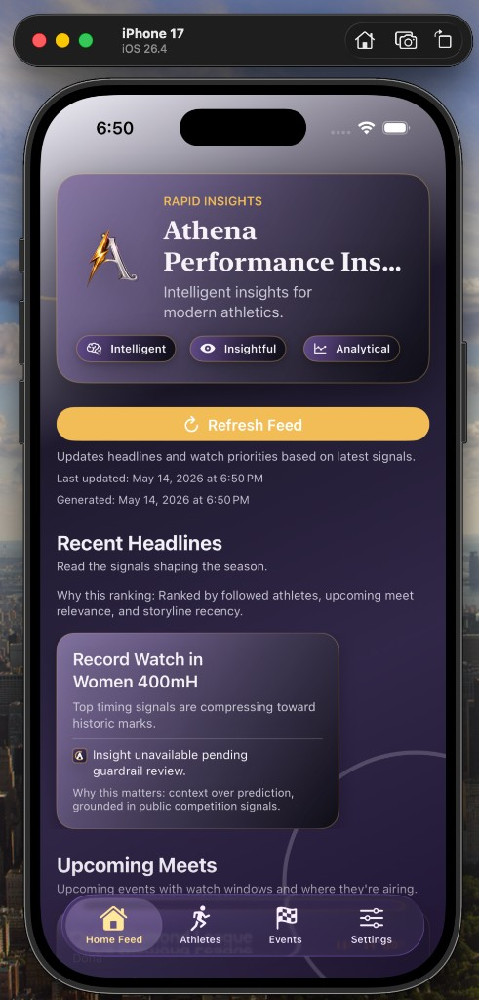
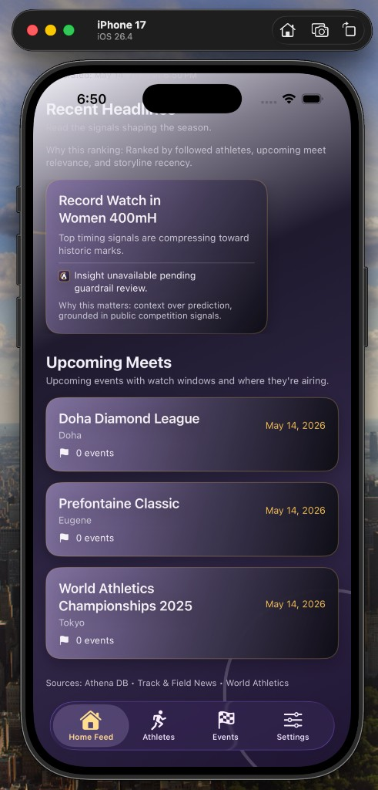
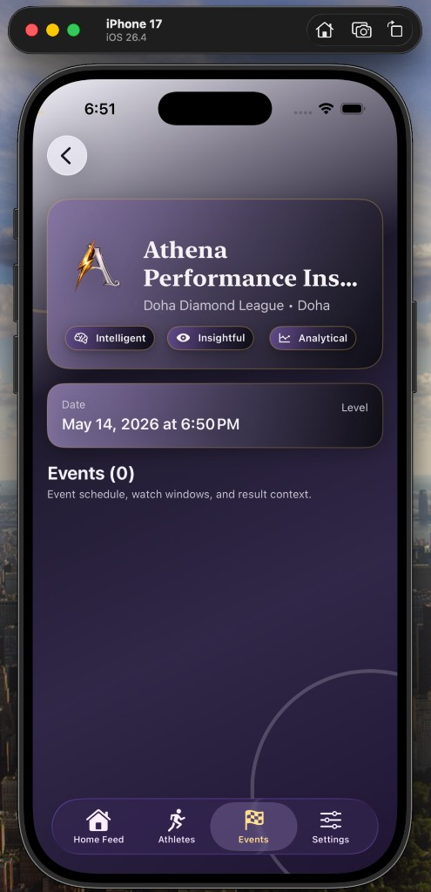
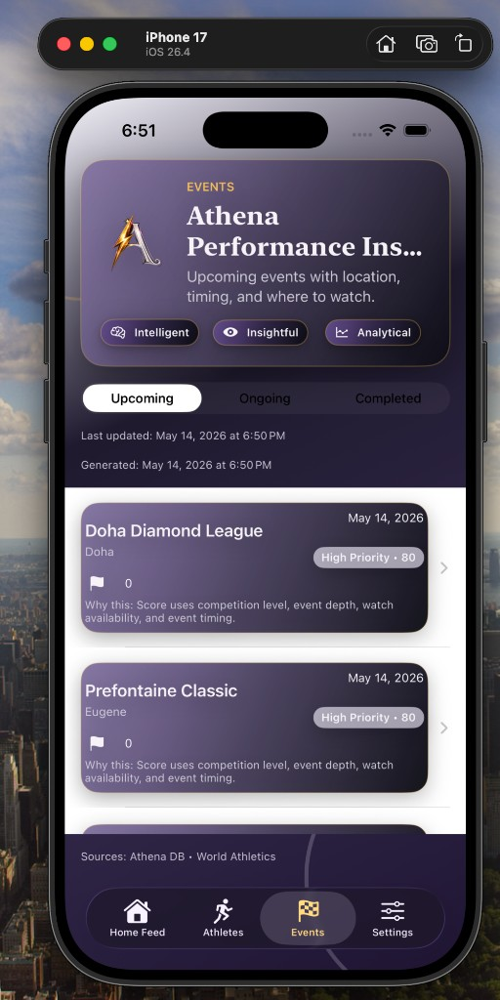
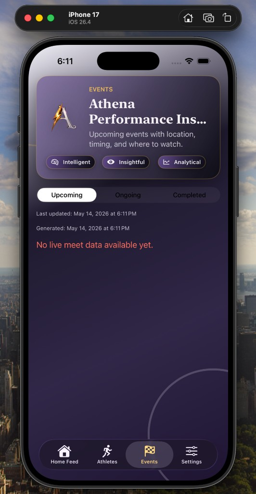
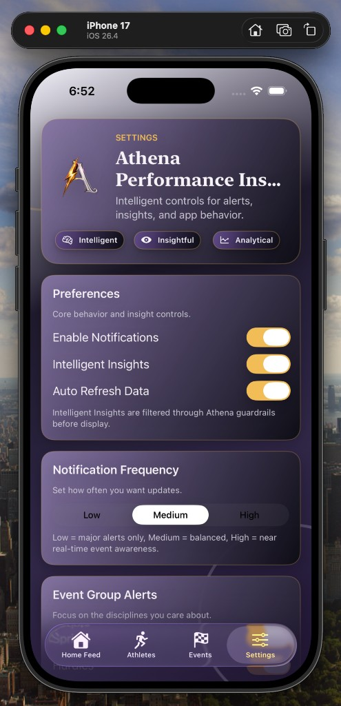
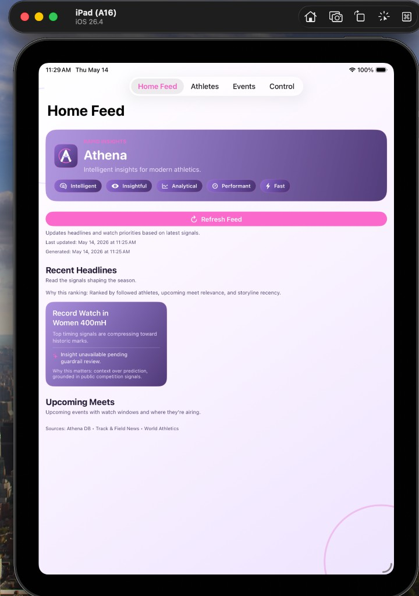
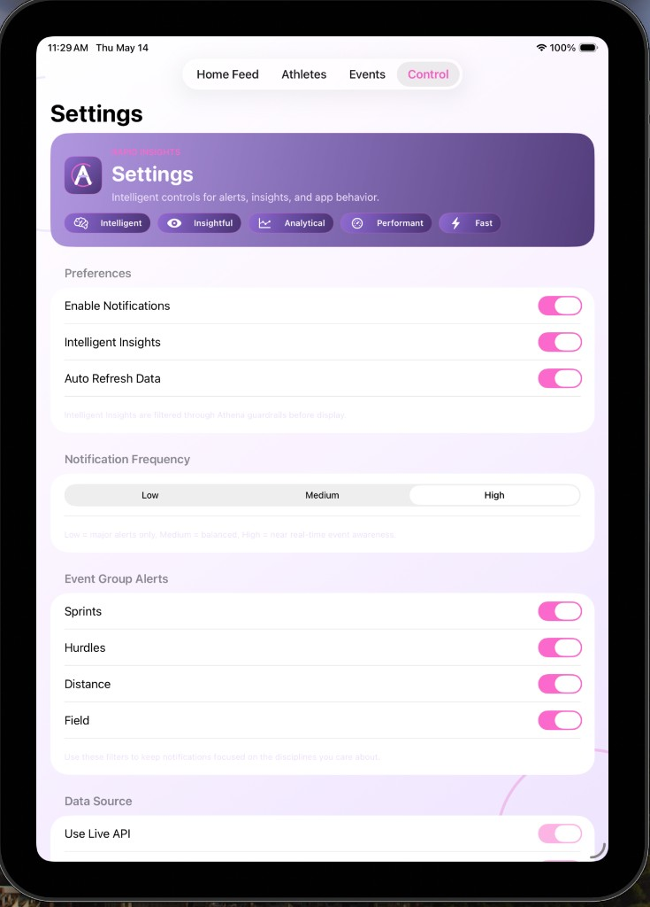

# Athena Performance Insights

**Strategic intelligence for elite performance.**

Athena Performance Insights is an iOS app that blends sports data, AI-powered insights, and competition awareness into a lightweight companion for athletes, fans, and analysts, starting with track and field and designed to scale across sports.

The product name used throughout the codebase and internal tooling is **Athena**. The full consumer-facing name is **Athena Performance Insights**. **App Store release under parent brand:** see [docs/BRAND.md](docs/BRAND.md) (*Athena by Tech & Toast*).

**Documentation:** [docs/README.md](docs/README.md) — vision, App Store kit, launch checklist.

---

## Why Athena Performance Insights
Sports data is abundant, but understanding is not. Athena focuses on **interpretation, awareness, and strategic context**—helping users understand not just what happened, but why it matters.

Athena is designed as a living track and field companion: what happened, what is happening, and what to watch next.

Athena is inspired by strength through intelligence: disciplined, resilient, and intentional.

---

## Screenshots

Simulator captures from the Athena Performance Insights MVP (iPhone + iPad).

### Home Feed
Rapid insights, competitive storylines, and upcoming meets — with AI insights gated by Athena guardrails.

<p align="center">
  
  &nbsp;
  
</p>

### Events
Meet awareness: upcoming / ongoing / completed, priority scoring, and event detail.

<p align="center">
  
  &nbsp;
  
  &nbsp;
  
</p>

### Settings
Notifications, intelligent insights, refresh behavior, and event-group alerts — filtered through Athena guardrails.

<p align="center">
  
</p>

### iPad
Adaptive layout for larger screens (Home Feed + Control / Settings).

<p align="center">
  
</p>
<p align="center">
  
</p>

All screenshots live in [`docs/images/screenshots/`](docs/images/screenshots/).

---

## Architecture
Built with SwiftUI and MVVM for a clean, maintainable iOS codebase.

- Models: Athlete, Meet, Event, Result, CompetitiveStoryline
- ViewModels: HomeViewModel, AthleteViewModel, MeetViewModel
- Views: Home, Athletes, Meets, Settings
- Services: APIService and NotificationService

---

## Tech Stack
- **Language:** Swift
- **UI:** SwiftUI
- **Architecture:** MVVM (lightweight)
- **AI:** Hugging Face hosted models
- **Minimum iOS:** 17.0
- **Concurrency:** async/await
- **Backend:** FastAPI + Uvicorn, containerized in Docker
- **Cloud:** Azure Container Apps, ACR, PostgreSQL, Key Vault, Service Bus, App Insights
- **Infrastructure:** Terraform (>=1.7, AzureRM provider), remote state in Azure Blob
- **Observability:** Sentry (iOS crash reporting), Azure Application Insights (backend)
- **CI/CD:** GitHub Actions (iOS CI, backend CI, Terraform CI/apply, TestFlight release)

---

## Local Setup

After cloning, run this once to activate the pre-push quality gate:

```bash
git config core.hooksPath .githooks
```

This wires the committed hook at `.githooks/pre-push`, which runs iOS build + Terraform validate + pytest + Alembic migration check before every push. Without this step, nothing catches failures locally.

---

## API Integration
Athena connects to a FastAPI backend (typically Azure Container Apps). Builds do **not** embed a live endpoint in source.

Configure the API base URL at build time:

| Surface | How |
|---------|-----|
| **Local Debug** | Copy `Config/Local.xcconfig.example` → `Config/Local.xcconfig` and set `ATHENA_API_BASE_URL`, **or** set the build setting in Xcode |
| **CI / TestFlight** | GitHub Actions secret `ATHENA_API_BASE_URL` (must be `https://…`) |
| **Runtime** | Info.plist key `AthenaAPIBaseURL` via `INFOPLIST_KEY_AthenaAPIBaseURL` |

Core service endpoints (relative to your base URL):

- `GET /health`
- `GET /athletes`
- `GET /meets`
- `GET /events/{eventID}/results`
- `GET /storylines`

Runtime API configuration is controlled via `ATHENA_MANAGED_API_SETTINGS=YES` in build settings. URL construction uses `URLComponents` to correctly split path and query string parameters.

Analytics and insight contracts are documented in the architecture specification.

---

## MVP Features
- Home feed with key competitive storylines
- Athlete following
- Meet awareness + where to watch
- AI‑generated performance insights
- Lightweight, intentional notifications
- Settings and preference controls

See the MVP Architecture document in this repository for full details.

### App Tabs
1. Home: dashboard with storylines and upcoming meets
2. Athletes: follow and analyze athlete profiles
3. Meets: discover event schedules and watch context
4. Settings: configure alerts, sources, and behavior

---

## Getting Started
1. Open the project in Xcode 16+
2. Configure API URL for local runs (required for live data):
   - `cp Config/Local.xcconfig.example Config/Local.xcconfig`
   - Set `ATHENA_API_BASE_URL = https://your-api-host` in that file
   - Or set `ATHENA_API_BASE_URL` on the Athena target’s Debug build settings
3. Select the Athena target and an iOS 17+ simulator
4. Build and run

Without a configured base URL, network calls fail closed (no hardcoded production host in the binary).

### Build Commands
```bash
swift test
xcodebuild -project Athena.xcodeproj -scheme Athena -destination 'platform=iOS Simulator,name=iPhone 16' build CODE_SIGNING_ALLOWED=NO
```

---

## Engineering Status (as of May 2026)

### Completed
- Live Azure backend deployed and healthy (configure URL via secrets / local xcconfig — not committed)
- All localhost fallbacks removed — production builds require `ATHENA_API_BASE_URL`
- URL construction rebuilt using `URLComponents` to prevent query string encoding as path segments
- `ATHENA_MANAGED_API_SETTINGS=YES` active in both Debug and Release
- Tolerant Swift model decoders added for `Meet` and `CompetitiveStoryline` (handles slim API payloads gracefully)
- Sentry SDK guarded — only activates when `SentryDSN` is non-empty; no fatal log noise when disabled
- Pre-push enforcement active via `.githooks/pre-push` → `scripts/pre_push_checks.sh`
  - Runs iOS build check, Terraform fmt/validate, backend pytest on changed files
- Engineering rules documented in `rules.md`
- GitHub Actions secrets/vars configured for TestFlight and Azure deploy workflows
- TestFlight release workflow (`release-testflight.yml`) ready to run

### In Progress
- TestFlight beta testing (internal)
- Monitoring Sentry + App Insights for real-user sessions
- AI backend integration (Hugging Face explanation layer)

### Next
- Ranking Impact Simulator
- Rivalry Heat Index
- Record Threat / Milestone Watch
- Breakout Radar (high school + college athletes)
- Source coverage expansion: MileSplit + Athletic.net

---

## Release and Deployment Plan

Athena uses a two-workflow release model:

- CI quality gate: `.github/workflows/ci.yml`
	- Runs on PRs and pushes to `dev`/`main`
	- Executes SwiftLint, Swift tests, and simulator build
	- Blocks bad changes before they can be released

- TestFlight release: `.github/workflows/release-testflight.yml`
	- Triggered by `v*` git tags or manual workflow dispatch
	- Archives + exports signed IPA
	- Uploads IPA artifact and submits to TestFlight
	- Uses `github.run_number` as `CURRENT_PROJECT_VERSION` to keep build numbers increasing

Recommended versioning:

1. Keep `MARKETING_VERSION` for semantic app versions (`1.0`, `1.1`, `1.2`).
2. Let CI set `CURRENT_PROJECT_VERSION` automatically per run.
3. Cut a release tag (`v1.0.0`, `v1.0.1`) for each production candidate.

### Required GitHub configuration (maintainers)

**Secrets** (never commit values):

| Secret | Purpose |
|---|---|
| `SIGNING_CERT_BASE64` | Distribution certificate (.p12, base64-encoded) |
| `SIGNING_CERT_PASSWORD` | Password used when exporting the .p12 |
| `KEYCHAIN_PASSWORD` | Temp keychain password for CI runner |
| `PROVISIONING_PROFILE_BASE64` | Provisioning profile (.mobileprovision, base64-encoded) |
| `APPSTORE_API_KEY_ID` | App Store Connect API key ID (App Manager role) |
| `APPSTORE_API_ISSUER_ID` | App Store Connect issuer ID |
| `APPSTORE_API_PRIVATE_KEY` | App Store Connect .p8 private key (full text, not base64) |
| `ATHENA_API_BASE_URL` | HTTPS API base URL for Release / ingest verification |
| `SENTRY_DSN` | Sentry DSN for crash reporting (leave empty to disable) |
| `AZURE_CLIENT_ID` / `AZURE_TENANT_ID` / `AZURE_SUBSCRIPTION_ID` | OIDC Azure login |
| `DATABASE_URL` | Backend DB connection (migrate/seed jobs) |

**Repository variables** (non-secret Azure resource names for deploy workflows):

| Variable | Purpose |
|---|---|
| `AZURE_ACR_NAME` | Azure Container Registry name |
| `AZURE_RESOURCE_GROUP` | Resource group |
| `AZURE_CONTAINER_APP_NAME` | Container App name |
| `AZURE_CONTAINER_APP_ENV` | Container Apps managed environment |
| `AZURE_MIGRATE_JOB_NAME` | Alembic migration job |
| `AZURE_SEED_JOB_NAME` | Seed job |
| `AZURE_INGEST_JOB_NAME` | Daily ingest job |

Notes for `ATHENA_API_BASE_URL`:

- Must start with `https://`.
- Prefer a custom domain mapped to Container Apps for production.
- Do **not** commit the live hostname in source, docs, or workflows.

## Cost Guardrails
- Start dev with the low-traffic Terraform profile (`infra/terraform/envs/dev/dev.tfvars.example`) and scale to zero where safe.
- Keep production on a baseline profile (`infra/terraform/envs/prod/prod.tfvars.example`) with `min_replicas >= 1`.
- Increase replicas, DB SKU, and queue tier only when metrics show sustained demand.
- Keep short log retention in dev and extend retention only for compliance or incident response needs.
- Review Azure spend and utilization monthly before changing SKU tiers.

---

## Reference Inputs
- World Athletics stats zone: https://worldathletics.org/stats-zone
- FloTrack rankings: https://www.flotrack.org/rankings
- Track and Field News major results: https://trackandfieldnews.com/major-results-links/
- LA28 athletics disciplines: https://hospitality.la28.org/en/event-discipline/athletics
- MileSplit results and athlete coverage: https://www.milesplit.com/
- Athletic.net performance and athlete coverage: https://www.athletic.net/

These inputs support Athena across professional, collegiate, and high school competition layers so the product can surface breakout athletes before they are fully established on the professional circuit.

---

## Open source under Tech & Toast™

Athena Performance Insights is published as open source under the **Tech & Toast: Uncorked** brand.

- **Parent brand:** [techntoastuncorked.com](https://www.techntoastuncorked.com) (company home — Athena is listed under this brand, not a separate product website)
- **Support:** techntoastuncorked@gmail.com
- **Sibling product:** Tech & Toast Vineyard (daily growth companion — separate repo)

Do not commit live API hosts, Azure resource FQDNs, signing material, or database credentials. Use GitHub secrets / repository variables and `Config/Local.xcconfig` (gitignored).

---

## License
Copyright (c) 2026 Alexandra McCoy / Tech & Toast: Uncorked
